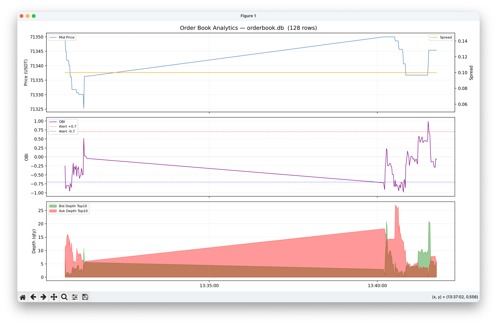

# Binance Order Book Sync

Синхронизация order book с Binance Futures через WebSocket с использованием REST snapshot для инициализации. Включает аналитику в реальном времени и визуализацию.

> ⚠️ **Важно**: GitHub Actions не позволяет обращаться к Binance API из-за ограничений по геолокации (HTTP 451). Запускайте локально или на сервере в разрешённом регионе.

## Описание

Скрипт подключается к WebSocket потоку Binance Futures, синхронизирует локальный order book через REST snapshot и буферизацию событий. Параллельно вычисляется аналитика и данные сохраняются в SQLite для последующей визуализации.

**Модули аналитики (`analytics/`):**
- `obi.py` — Order Book Imbalance (OBI): `(bid_sum - ask_sum) / (bid_sum + ask_sum)`, топ-N уровней, значение в `[-1.0, 1.0]`
- `whale.py` — детектор крупных стен: логирует новые уровни, где `qty >= mean_qty * threshold`
- `timeseries.py` — запись снапшотов в SQLite (`orderbook.db`) с заданным интервалом

## Пример вывода

```
========================================================================
ORDER BOOK (top 10) | best_bid=77899.0 best_ask=77899.1 spread=0.10000000000582077
------------------------------------------------------------------------
BIDS (price, qty)                  | ASKS (price, qty)
------------------------------------------------------------------------
77899.00  3.011000                 | 77899.10  0.175000
77898.90  0.021000                 | 77899.20  0.008000
77898.80  0.003000                 | 77899.40  0.003000
...
========================================================================
```



## Установка

```bash
pip install -r requirements.txt
```

## Использование

### Запуск стрима

```bash
# Символ по умолчанию: btcusdt
python main.py

# Через переменную окружения
SYMBOL=ethusdt python main.py

# Через аргумент командной строки (приоритет выше env)
python main.py ethusdt
```

### Визуализация

```bash
# Весь датасет из orderbook.db
python plot.py

# Последние 300 строк
python plot.py --last 300

# Другой файл БД
python plot.py --db path/to/db
```

### Тесты

```bash
pytest tests/
```

## Настройка

### Переменные окружения

| Переменная | По умолчанию | Описание |
|---|---|---|
| `SYMBOL` | `btcusdt` | Торговая пара |

### Параметры `handle_websocket` в `main.py`

| Параметр | По умолчанию | Описание |
|---|---|---|
| `snapshot_limit` | `1000` | Глубина REST snapshot |
| `prebuffer_count` | `50` | Событий в предбуфере до snapshot |
| `print_every_sec` | `1.0` | Интервал вывода order book (сек) |
| `top_n` | `10` | Уровней для отображения |

### Параметры аналитики

- `WhaleDetector(threshold=10.0)` — порог для детекции стен (кратно среднему qty)
- `TimeseriesRecorder(db_path="orderbook.db", interval_sec=1.0)` — путь к БД и интервал записи
- `compute_obi(order_book, n=10)` — количество уровней для расчёта OBI
